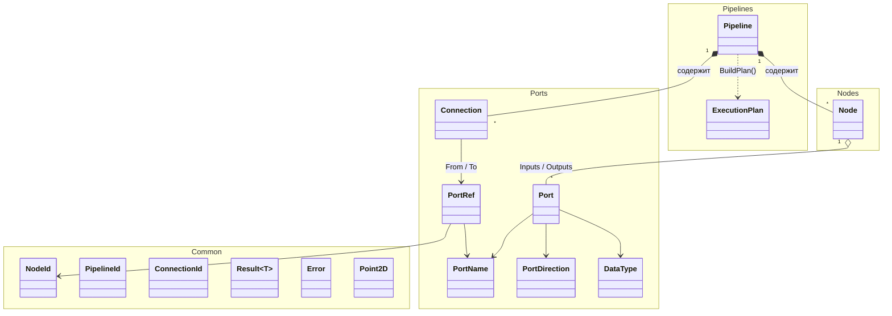

# Reactive Pipeline Editor

Визуальный редактор для построения и запуска data-processing пайплайнов.

## Building

```
dotnet build
```

## Running

```
dotnet run --project src/ReactivePipelineEditor.App
```

## Tests

```
dotnet test
```

Все тесты лежат в `tests/ReactivePipelineEditor.Domain.Tests`, стек — xUnit + FluentAssertions.

## Domain model

Домен — ядро приложения: он не знает ни про WPF, ни про файловую систему. Всё, что можно
проверить без UI и без запуска обработки, проверяется здесь.



### `Pipeline`

Корневой агрегат (`src/ReactivePipelineEditor.Domain/Pipelines/Pipeline.cs`). Хранит узлы и
соединения, отвечает за целостность графа.

| Операция | Назначение |
|---|---|
| `AddNode(Node)` | Добавляет узел; дубликат `NodeId` — `Error.Conflict` |
| `RemoveNode(NodeId)` | Удаляет узел; отсутствующий — `Error.NotFound` |
| `FindNode(NodeId)` | Ищет узел по идентификатору |
| `Connect(PortRef, PortRef)` | Соединяет порты с полной валидацией |
| `Disconnect(ConnectionId)` | Разрывает соединение |
| `BuildPlan()` | Строит `ExecutionPlan` |

`Connect` проверяет всё, что можно проверить статически, ещё до создания соединения:

1. обе ноды существуют;
2. выходной порт есть у источника, входной — у приёмника;
3. типы совместимы: `toPort.Type.IsAssignableFrom(fromPort.Type)`;
4. у входного порта ещё нет входящего соединения (вход принимает ровно одно ребро);
5. узел не соединяется сам с собой.

Все ошибки возвращаются через `Result<T>`, а не исключениями: отказ в соединении — это
ожидаемая ситуация, а не сбой.

`BuildPlan` последовательно проверяет, что пайплайн не пуст, что нет висячих входов
(`FindDanglingInputs`) и что граф ацикличен (топологическая сортировка, алгоритм Кана; цикл —
`Error.Conflict`). На выходе — иммутабельный снапшот `ExecutionPlan` с `ExecutionOrder`,
`Nodes` и `Connections`.

### `Node`

Абстрактный узел (`src/ReactivePipelineEditor.Domain/Nodes/Node.cs`): `Id`, `DisplayName`,
`Position` и два списка портов — `Inputs` / `Outputs`. Позиция — собственный `Point2D`,
а не `System.Windows.Point`: домен не имеет права зависеть от WPF.

| Узел | Входы | Выходы |
|---|---|---|
| `CsvSourceNode` | — | `Out`: `RawRecord` |
| `FilterNode` | `In`: `RawRecord` | `Passed`, `Rejected`: `RawRecord` |
| `MapNode` | `In`: `RawRecord` | `Out`: `Record` |
| `ValidateNode` | `In`: `Record` | `Valid`, `Invalid`: `Record` |
| `AggregateNode` | `In`: `Record` | `Out`: `Aggregate` |
| `JsonSinkNode` | `In`: `Aggregate` | — |
| `DeadLetterSinkNode` | `In`: `RawRecord` | — |

### `Port` и `DataType`

Порт (`src/ReactivePipelineEditor.Domain/Ports/Port.cs`) — это имя, направление и тип данных:

```csharp
public sealed record Port(PortName Name, PortDirection Direction, DataType Type);
```

`DataType` образует ковариантную иерархию, где стрелка идёт в одну сторону:

```
RawRecord  →  Record  →  Aggregate
```

`IsAssignableFrom` разрешает подать на вход **более специализированный** тип: выход
`Aggregate` можно подключить к входу `RawRecord`, но выход `RawRecord` — никогда к входу
`Aggregate`. Именно это отсекает бессмысленные соединения на этапе редактирования графа,
а не в runtime.

### `Connection` и `PortRef`

`PortRef(NodeId, PortName)` — адрес порта в графе, `Connection(ConnectionId, From, To)` —
неизменяемое ребро между двумя адресами. Оба — `record`-типы со структурным равенством,
поэтому проверка «порт уже занят» сводится к сравнению `PortRef`.

### `Result<T>` и `Error`

Доменные операции возвращают `Result<T>`, а не бросают исключения на ожидаемых ошибках
(`src/ReactivePipelineEditor.Domain/Common/Result.cs`). `Error` несёт код и сообщение и
создаётся фабриками `Error.NotFound`, `Error.Conflict`, `Error.Validation`.

### Типизированные идентификаторы

`NodeId`, `PipelineId`, `ConnectionId` — независимые `readonly record struct`-обёртки над
`Guid`. Компилятор не даст перепутать идентификатор узла с идентификатором пайплайна, а
конструкторы закрыты: `Guid.Empty` в домен не пройдёт (см. ADR-003).

## Пример: `DomainSmokeTest`

`tools/DomainSmokeTest` — консольное приложение, которое собирает пайплайн «CSV → фильтр →
маппинг → агрегация → JSON» и печатает план выполнения. Быстрая проверка домена end-to-end
без запуска WPF:

```
dotnet run --project tools/DomainSmokeTest
```

```csharp
using System.Text;

using ReactivePipelineEditor.Domain.Common;
using ReactivePipelineEditor.Domain.Nodes;
using ReactivePipelineEditor.Domain.Pipelines;
using ReactivePipelineEditor.Domain.Ports;

Console.OutputEncoding = Encoding.UTF8;
var pipeline = new Pipeline(PipelineId.New(), "smoke test");

var csv = new CsvSourceNode(NodeId.New(), new Point2D(0, 0), "input.csv");
var filter = new FilterNode(NodeId.New(), new Point2D(200, 0), "Amount > 1000");
var map = new MapNode(NodeId.New(), new Point2D(400, 0), "new { Amount = decimal.Parse(Amount) }");
var aggregate = new AggregateNode(NodeId.New(), new Point2D(600, 0), "Country", "Sum(Amount)");
var sink = new JsonSinkNode(NodeId.New(), new Point2D(800, 0), "output.json");

pipeline.AddNode(csv);
pipeline.AddNode(filter);
pipeline.AddNode(map);
pipeline.AddNode(aggregate);
pipeline.AddNode(sink);

// RawRecord -> RawRecord
var r1 = pipeline.Connect(
    new PortRef(csv.Id, CsvSourceNode.OutPortName),
    new PortRef(filter.Id, FilterNode.InPortName));
Console.WriteLine($"Connect csv → filter: {r1.IsSuccess}");

// RawRecord -> RawRecord: Map is what turns a raw CSV row into a typed Record
var r2 = pipeline.Connect(
    new PortRef(filter.Id, FilterNode.PassedPortName),
    new PortRef(map.Id, MapNode.InPortName));
Console.WriteLine($"Connect filter → map: {r2.IsSuccess}");

// Record -> Record: Aggregate requires typed fields, so it must follow Map
var r3 = pipeline.Connect(
    new PortRef(map.Id, MapNode.OutPortName),
    new PortRef(aggregate.Id, AggregateNode.InPortName));
Console.WriteLine($"Connect map → aggregate: {r3.IsSuccess}");

// Aggregate -> Aggregate: the sink declares the most derived input type
var r4 = pipeline.Connect(
    new PortRef(aggregate.Id, AggregateNode.OutPortName),
    new PortRef(sink.Id, JsonSinkNode.InPortName));
Console.WriteLine($"Connect aggregate → sink: {r4.IsSuccess}");

var planResult = pipeline.BuildPlan();
if (planResult.IsSuccess)
{
    Console.WriteLine("Execution order:");
    foreach (var id in planResult.Value.ExecutionOrder)
        Console.WriteLine($"  {planResult.Value.Nodes[id].DisplayName}");
}
else
{
    Console.WriteLine($"Failed: {planResult.Error!.Value.Message}");
}
```

Вывод:

```
Connect csv → filter: True
Connect filter → map: True
Connect map → aggregate: True
Connect aggregate → sink: True
Execution order:
  Csv Source
  Filter
  Map
  Aggregate
  Json Sink
```

Обратите внимание на порядок соединений: цепочка типов `RawRecord → Record → Aggregate`
проходится ровно один раз, и `JsonSinkNode` получает именно тот тип, который объявил на
своём входе. Попытка соединить `FilterNode.Passed` напрямую с `JsonSinkNode.In` вернёт
`False` с `Error.Validation("Cannot connect RawRecord to Aggregate")`.

## Status

Домен поддерживает:

- создание пайплайнов с типизированными идентификаторами (`NodeId`, `PipelineId`, `ConnectionId`);
- добавление узлов разных типов (7 конкретных узлов);
- соединение портов с полной валидацией;
- построение плана выполнения через топологическую сортировку;
- 90+ unit-тестов.

Дополнительно: смоук-тест в консольном приложении (`tools/DomainSmokeTest`).

## ADR

Архитектурные решения фиксируются в `docs/adr`:

- [ADR-002 — Использование CommunityToolkit.Mvvm для MVVM-слоя](<docs/adr/ADR-002 Использование CommunityToolkit.Mvvm для MVVM-слоя.md>) —
  почему MVVM реализован через toolkit, а не собственной инфраструктурой.
- [ADR-003 — Использование record struct для NodeId, PipelineId, ConnectionId](<docs/adr/ADR-003. Использование record struct для NodeId, PipelineId, ConnectionId.md>) —
  почему идентификаторы — типизированные `record struct`, а не «сырые» `Guid`.
- [ADR-004 — Использование иерархической системы типов DataType](<docs/adr/ADR-004. Использование иерархической системы типов DataType.md>) —
  ковариантность `RawRecord → Record → Aggregate` и валидация соединений портов.
